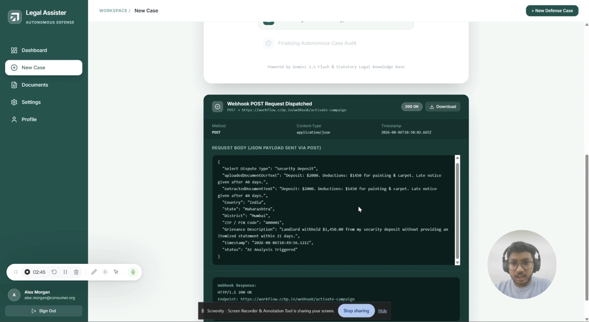
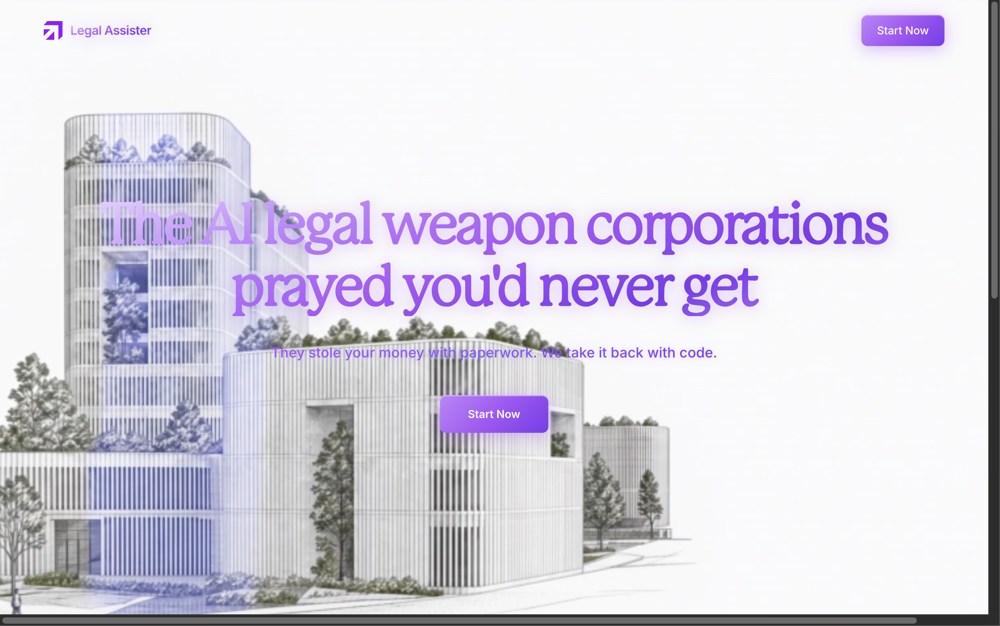
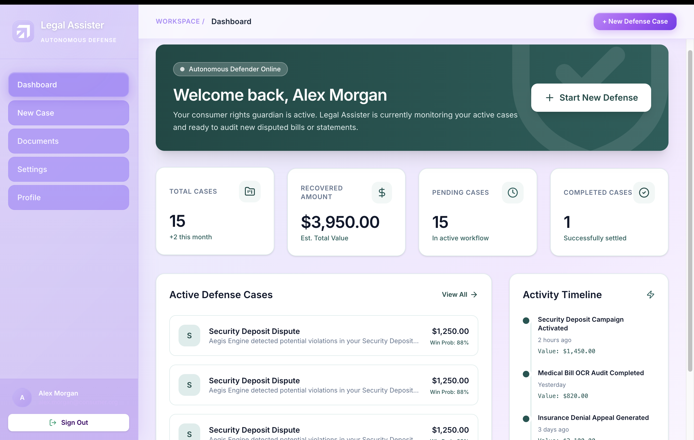
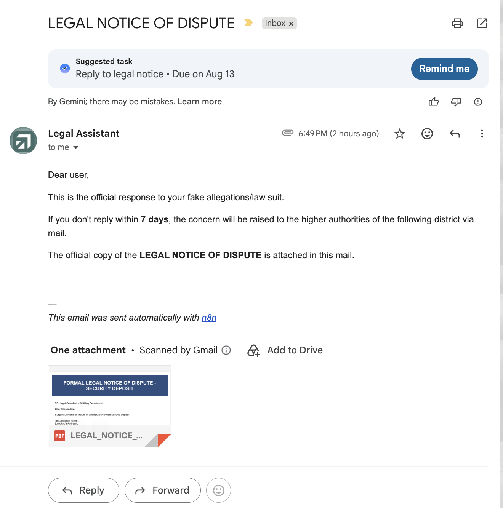
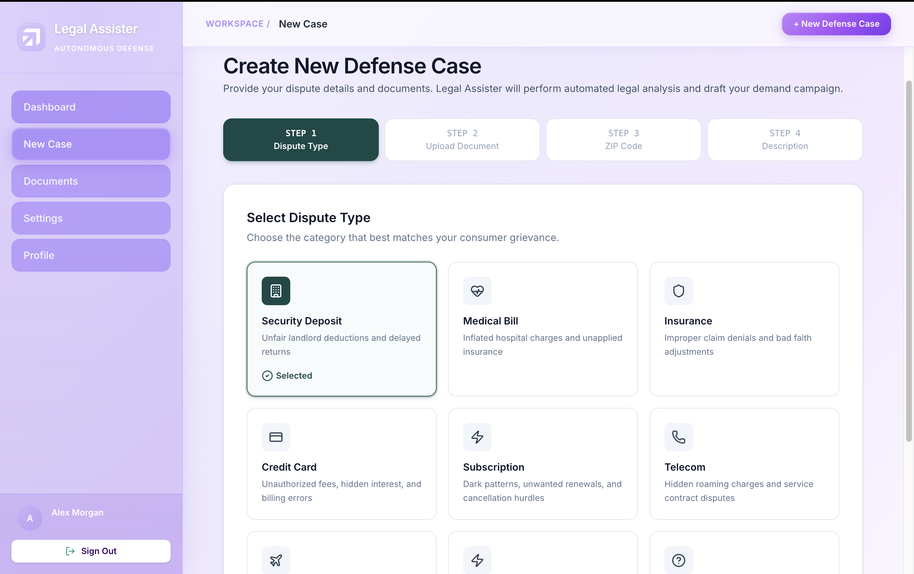

# ⚖️ Legal Assister

### AI-Powered Consumer Legal Assistance Platform

<p align="center">


</p>

<p align="center">
AI-powered legal complaint assistant that helps consumers generate, format, and submit complaints directly to the appropriate legal authority through automated workflows.
</p>

---

## 👨‍💻 Developed By

- **@merakstack**
- **@shiva-code-og**
- **sreeshanth1224**
- **@navaneesh**

---

# 🌟 Overview

Legal Assister is an AI-powered legal assistance platform designed to help ordinary citizens stand up against corporations engaging in unfair or illegal practices.

The platform simplifies the complaint filing process by collecting user information, generating a professionally formatted legal complaint, converting it into a PDF, and automatically sending it to the appropriate legal authority using an automated **n8n workflow**.
# visit at : https://legal-assistor.onrender.com/

Whether the issue is:

- Consumer Fraud
- Hospital Overcharging
- Hidden Charges
- Vendor Malpractice
- Refund Disputes
- Warranty Violations
- Billing Errors
- Digital Payment Fraud

Legal Assister helps users prepare and submit formal legal complaints within minutes.

---

# 🎥 Demo

<p align="center">
  <a href="https://drive.google.com/file/d/11ILVQLMvxxeutybbo5ZUEv2H2zVMmn4d/view?usp=sharing" target="_blank">
    
  </a>
</p>

<p align="center">
  <b>👆 Click the image above to watch the demo video</b>
</p>
---

# ✨ Features

- ⚖️ AI-powered complaint drafting
- 📝 Interactive complaint form
- 📄 Automatic PDF generation
- 📧 Email complaints directly to authorities
- 🔄 n8n workflow automation
- 🤖 AI-assisted legal formatting
- ⚡ Fast Next.js interface
- 🔒 Secure user information
- 🌐 Responsive design
- 📤 One-click complaint submission

---

# 🛠 Tech Stack

<p align="center">


<br><br>


</p>

---

# 📸 Project Screenshots

<p align="center">

<table>
<tr>

<td align="center">


**🏠 Home Page**

</td>

<td align="center">


**📝 Complaint Form**

</td>

</tr>

<tr>

<td align="center">


**📄 Complaint Preview**

</td>

<td align="center">


**✅ Successful Submission**

</td>

</tr>
</table>

</p>

---

# ⚙️ Architecture

```text
                         FRONTEND LAYER
┌────────────────────────────────────────────────────────────┐
│                  Next.js (App Router)                      │
│                                                            │
│  • TypeScript                                              │
│  • Complaint Form                                          │
│  • Responsive UI                                           │
└──────────────────────────┬─────────────────────────────────┘
                           │
                           │ POST Request
                           ▼

                  AUTOMATION LAYER

┌────────────────────────────────────────────────────────────┐
│                    n8n Workflow                            │
│                                                            │
│ • Receive Complaint Data                                   │
│ • Validate User Inputs                                     │
│ • Generate Complaint PDF                                   │
│ • Select Legal Authority                                   │
│ • Send Email via Gmail API                                 │
└──────────────────────────┬─────────────────────────────────┘
                           │
                           ▼

                  EXTERNAL SERVICES

      ┌─────────────────────┐
      │   PDF Generator     │
      └─────────────────────┘

      ┌─────────────────────┐
      │     Gmail API       │
      └─────────────────────┘

      ┌─────────────────────┐
      │     Supabase        │
      └─────────────────────┘
```

---

# 🚀 Installation

## Clone Repository

```bash
git clone https://github.com/yourusername/legal-assister.git

cd legal-assister
```

---

## Install Dependencies

Using npm

```bash
npm install
```

Using pnpm

```bash
pnpm install
```

Using yarn

```bash
yarn
```

---

# 🔑 Environment Variables

Create a `.env.local`

```env
# Gemini
GEMINI_API_KEY=YOUR_GEMINI_API_KEY

# Supabase
NEXT_PUBLIC_SUPABASE_URL=YOUR_SUPABASE_URL
NEXT_PUBLIC_SUPABASE_ANON_KEY=YOUR_SUPABASE_KEY

# Google OAuth
NEXT_PUBLIC_GOOGLE_CLIENT_ID=YOUR_CLIENT_ID

# Webhooks
NEXT_PUBLIC_WEBHOOK_URL=YOUR_WEBHOOK
LEGAL_MAIL_WEBHOOK_URL=YOUR_LEGAL_WEBHOOK

# App
APP_URL=http://localhost:3000
```

---

# ▶️ Run Locally

```bash
npm run dev
```

Open

```
http://localhost:3000
```

---

# 📦 Production

```bash
npm run build

npm start
```

---

# 📂 Project Structure

```text
Legal-Assister
│
├── app
├── components
├── lib
├── public
│   ├── project1.png
│   ├── project2.png
│   ├── project3.png
│   └── project4.png
│
├── styles
├── .env.local
├── package.json
└── README.md
```

---

# 🔄 Workflow

```text
User Opens Website
        │
        ▼
Describe Legal Issue
        │
        ▼
AI Collects Details
        │
        ▼
Review Complaint
        │
        ▼
Submit Complaint
        │
        ▼
POST → n8n Webhook
        │
        ▼
Generate PDF
        │
        ▼
Identify Authority
        │
        ▼
Send Email
        │
        ▼
Success Response
```

---

# 💼 Use Cases

- Consumer Fraud
- Hospital Overcharging
- Hidden Charges
- Billing Disputes
- Vendor Malpractice
- Refund Issues
- Warranty Claims
- Digital Payment Fraud
- Product Defects
- Consumer Rights Violations

---

# 🌍 Deployment

<p align="center">


</p>

---

# 🤝 Contributing

Contributions are welcome!

```bash
# Fork the repository

git checkout -b feature/amazing-feature

git commit -m "Add amazing feature"

git push origin feature/amazing-feature
```

Open a Pull Request.

---

# 📜 License

This project is licensed under the **MIT License**.

---

# ⚖️ Protect. Report. Generate. Submit.

<p align="center">

**Legal Assister transforms complex consumer complaint procedures into a streamlined AI-powered workflow, enabling individuals to seek justice with confidence.**

⭐ If you like this project, don't forget to star the repository!

</p>
